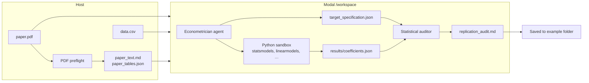

# ReplicateAI

From paper PDF + public CSV → a referee-style audit of the headline coefficient.

ReplicateAI autonomously replicates the headline empirical coefficient of an applied economics paper: it reads the PDF, writes a Python estimation script, runs it in a [Modal](https://modal.com) sandbox, debugs failures, and produces `replication_audit.md` with verdicts MATCH, CLOSE, MISMATCH, or FAILED against published numbers.

Built with [LangChain Deep Agents](https://docs.langchain.com/oss/python/deepagents/overview). This is a portfolio / research demo with curated example packs — not a general “replicate any paper” product. See [what it is not](#what-it-is-not) below.

---

## How it works




| Stage             | Where                                    | Output                                                                           |
| ----------------- | ---------------------------------------- | -------------------------------------------------------------------------------- |
| PDF extraction    | Host (PyMuPDF, Camelot)                  | `paper_text.md`, `paper_tables.json`                                             |
| Spec + estimation | Modal sandbox                            | `target_specification.json`, `scripts/attempt_*.py`, `results/coefficients.json` |
| Audit             | Auditor sub-agent (host LLM, sandbox FS) | `replication_audit.md`                                                           |


On a TTY you get a Textual dashboard: run phases, live sandbox log, headline coefficient card, scrollable audit. Details: [docs/DESIGN_TUI.md](./docs/DESIGN_TUI.md).

---

## Quick start

Prerequisites: Python 3.11+, [uv](https://docs.astral.sh/uv/), [Modal](https://modal.com) account, an LLM API key (Anthropic recommended for demos). For PDF tables on macOS: `brew install ghostscript`.

```bash
git clone https://github.com/samikh-git/replicate-ai.git && cd replciate-ai/replicate_ai

uv sync
cp .env.example .env          # ANTHROPIC_API_KEY, etc.
uv run modal token new        # one-time Modal auth

# Card & Krueger ships PDF + data in-repo
uv run replicate-ai ../examples/card_krueger
```

After a successful run, the audit is written to `examples/card_krueger/replication_audit.md` (override with `--audit-out`; press `s` in the TUI to save again).

Other example packs: fetch data, add `paper.pdf`, then run — see [examples/README.md](./examples/README.md).

Full setup (providers, env vars, flags): [replicate_ai/README.md](./replicate_ai/README.md).

```bash
# CI / plain stdout (no TUI)
uv run replicate-ai --no-tui ../examples/card_krueger

# Fake TUI demo (no Modal / LLM)
uv run replicate-ai --tui-demo

# Tests
cd replicate_ai && uv run pytest -q
```

---

## Example packs

Curated paper + dataset bundles under `[examples/](./examples/)`. Each includes a data script, `target_spec_reference.json` (published benchmarks for the auditor), and setup notes.


| Pack                                                                 | Paper                            | Notes                           |
| -------------------------------------------------------------------- | -------------------------------- | ------------------------------- |
| `[card_krueger](./examples/card_krueger/)`                           | Card & Krueger (1994)            | Demo; PDF + data in-repo        |
| `[dehejia_wahba](./examples/dehejia_wahba/)`                         | Dehejia & Wahba (1999)           | LaLonde NSW; demonstrated MATCH |
| `[imbens_lottery](./examples/imbens_lottery/)`                       | Imbens, Rubin & Sacerdote (2001) | Run candidate                   |
| `[angrist_lavy](./examples/angrist_lavy/)`                           | Angrist & Lavy (1999)            | Run candidate                   |
| `[autor_dorn_hanson](./examples/autor_dorn_hanson/)`                 | Autor, Dorn & Hanson (2013)      | Run candidate                   |
| `[acemoglu_johnson_robinson](./examples/acemoglu_johnson_robinson/)` | AJR (2001)                       | Run candidate                   |


Paper DOIs and PDF links: [examples/README.md](./examples/README.md).

---

## Repository layout

```
replciate-ai/
├── README.md                 # you are here
├── docs/                     # design, TUI spec, roadmap
├── AGENTS.md                 # guidance for AI coding agents
├── examples/                 # paper + data packs (not the Python package)
│   ├── README.md
│   └── <pack>/               # data.csv, paper.pdf, data_population_script.py, …
└── replicate_ai/             # installable package + CLI
    ├── pyproject.toml
    ├── .env.example
    ├── src/replicate_ai/
    └── tests/
```

Application code and CLI live under `replicate_ai/`. Run `uv` and `replicate-ai` from that directory unless noted.

---

## What it is not

- Not arbitrary papers — curated packs with public data and a single headline estimand per run.
- Not Stata/R — Python only in the sandbox (`statsmodels`, `linearmodels`, `pyfixest`, …).
- Not credentialed microdata (PSID, Compustat, restricted Census, …).
- Not full-table replication — one headline coefficient and one audit per run.
- Not production hosting, auth, or billing.

Non-goals and schemas: [DESIGN.md §2 & §10](./docs/DESIGN.md). Planned work: [ROADMAP.md](./docs/ROADMAP.md).

---

## Documentation


| Document                                           | Purpose                                                 |
| -------------------------------------------------- | ------------------------------------------------------- |
| [docs/README.md](./docs/README.md)                 | Index of design docs                                    |
| [replicate_ai/README.md](./replicate_ai/README.md) | Setup, env vars, LLM providers, CLI flags               |
| [docs/DESIGN.md](./docs/DESIGN.md)                 | System design, `/workspace` contract, auditor tolerance |
| [docs/DESIGN_TUI.md](./docs/DESIGN_TUI.md)         | Dashboard UX                                            |
| [docs/ROADMAP.md](./docs/ROADMAP.md)               | Benchmarks, registry direction, open questions          |
| [examples/README.md](./examples/README.md)         | Example packs, paper links, setup checklist             |
| [AGENTS.md](./AGENTS.md)                           | Conventions for contributors and coding agents          |


---

## Status

Working end-to-end: PDF → agent loop → audit file, with TUI and multi-provider LLM support.

Demonstrated MATCH on headline estimands: Card & Krueger, Dehejia–Wahba (experimental NSW). Other packs are run candidates — not pre-certified benchmarks until logged in a future `BENCHMARK.md` ([docs/ROADMAP.md](./docs/ROADMAP.md)).

Contributions: pick an item from Now in the roadmap; match patterns in [AGENTS.md](./AGENTS.md).