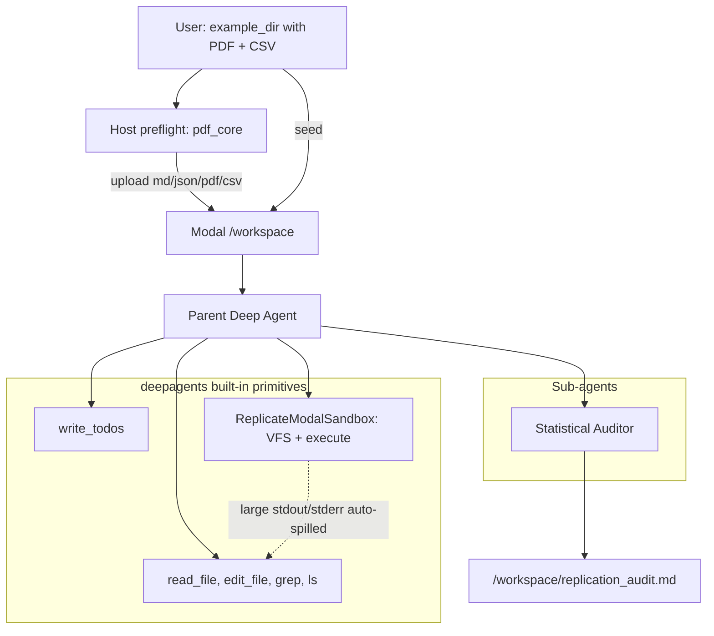
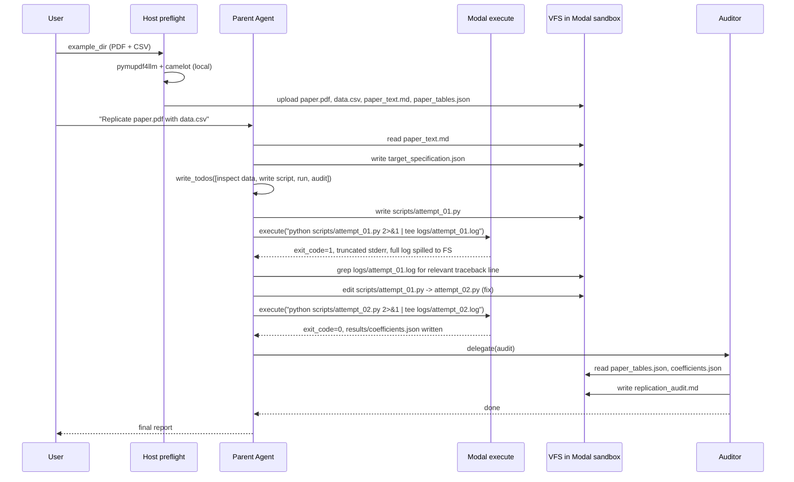

# ReplicateAI — Design Document

**Status**: Draft v0.2 (aligned with implemented host-preflight + Modal execution split)
**Author**: Sami
**Last updated**: 2026-05-25
**Target deliverable**: 10-day portfolio demo

---

## 1. Overview

ReplicateAI is an autonomous agent that takes the PDF of an applied-economics paper and a raw dataset, and reproduces the paper's headline empirical result without any pre-shipped replication code. The agent identifies the econometric specification from the paper's text, writes a script to estimate it, runs that script in a sandbox, debugs whatever breaks, and audits its own output against the published numbers.

The system is built on the [LangChain Deep Agents SDK](https://docs.langchain.com/oss/python/deepagents/overview), which provides the harness primitives (planning tool, virtual filesystem, sub-agents, log offloading) that make a long, error-prone, multi-stage task tractable for an LLM.

This document describes the v1 design: a **single hand-picked paper, single dataset, single happy-path narrative** intended as a portfolio piece. Section 10 enumerates what is intentionally out of scope.

## 2. Goals and non-goals

### Goals

- Demonstrate end-to-end autonomy on one curated paper: PDF in, audit report out, no human intervention in the inner loop.
- Make the **autonomous debugging loop visible** in the demo (planted bug, agent reads logs, agent edits script, agent re-runs).
- Produce a recorded demo video and a transcript suitable for a portfolio README.
- Stay honest in the README about what is curated vs. general.

### Non-goals (v1)

- Generality across arbitrary economics papers
- Stata, R, MATLAB, or Julia execution paths
- Replicating papers that depend on credentialed data (PSID, Compustat, IPUMS, Census microdata, etc.)
- Reproducing every table and figure — only the paper's headline coefficient(s)
- Multi-tenant deployment, auth, billing, or any production infrastructure
- Beating the [AEA Data Editor's existing replication pipeline](https://github.com/AEADataEditor/replication-template) on inventory/dependency analysis — that pipeline is more thorough at static analysis; our wedge is *dynamic* autonomous debugging.

## 3. Background

### Why economics replication is the right testbed

Most LLM-agent demos pick tasks where success is mostly about retrieval and synthesis. Replication of an empirical paper is harder in a productive way:

- The work is **multi-modal**: dense LaTeX prose, equations, tables, and chaotic stdout from broken scripts.
- It is **inherently iterative**: nearly every realistic run fails at least once on a deprecation, a dtype mismatch, or a missing column.
- The **success criterion is numeric and externally given** — the agent cannot bluff its way through; the published β is the published β.
- The error mode where the agent loses the plot under a 500-line traceback is exactly the failure mode Deep Agents was designed to fix via context offloading.

### Why Deep Agents specifically

Per the [`create_deep_agent` API reference](https://reference.langchain.com/python/deepagents/graph/create_deep_agent), the SDK already provides the four primitives this project leans on:

1. **`write_todos`** — a state-tracked planning tool that survives token flushes.
2. **A virtual filesystem** with `read_file`, `edit_file`, `grep`, `ls`. Tool outputs that are too large get spilled to files automatically.
3. **First-class `subagents=[...]`** — isolated context windows for delegated work.
4. **A `backend` slot** that can plug in a sandbox-execution backend (`SandboxBackendProtocol`).

This means most of what would be "agent harness engineering" is already done. Our work is **host-side PDF preflight** (not an agent tool), one sub-agent, system prompts, and wiring (`ModalSandbox` + `uv` image build).

## 4. Target paper (v1)

**Primary**: Card & Krueger (1994), "Minimum Wages and Employment: A Case Study of the Fast-Food Industry in New Jersey and Pennsylvania." *AER* 84(4): 772–793.

Why this paper:

- The data (NJ–PA fast-food survey) is small (~400 rows), public, and well-documented.
- The headline specification is a difference-in-differences with a published, well-known coefficient direction.
- The paper is canonical enough that any economist watching the demo immediately understands the result.
- The estimate is robust — re-implementations consistently land near the published numbers.

Backup options (decided at implementation start):

- Mincer wage regression on a CPS extract (trivial OLS, very canonical)
- Reinhart & Rogoff (2010) (high-risk, high-reward — the demo could end with the agent surfacing the famous Excel-row bug autonomously; brittle but unforgettable)
- Acemoglu-Johnson-Robinson (2001) (IV on settler-mortality data; more econometrically interesting but heavier data-prep)

The paper choice is **frozen on day 1** of implementation. Switching mid-build invalidates several days of prompt tuning.

## 5. System architecture

The architecture leans heavily on built-in `deepagents` primitives. **PDF parsing runs on the host** (CPU-heavy OCR/Camelot); **econometric code runs in Modal** via the `ModalSandbox` backend (see [Sandboxes](https://docs.langchain.com/oss/python/deepagents/customization)). There is no persistent host `workspace/` directory — inputs are copied from an example pack (or user-provided paths) into Modal `/workspace` at run start.



### Host vs Modal responsibilities

| Stage | Where | Why |
|-------|--------|-----|
| PDF → `paper_text.md`, `paper_tables.json` | **Host** (`preflight.py` + `tools/pdf_core.py`) | OCR/Camelot are CPU-heavy; running them in Modal burns sandbox time and bloats the image |
| Seed `paper.pdf`, `data.csv` | **Host → Modal** (`filesystem.copy_from_local`) | User drops files in `examples/card_krueger/` (or similar); no local mirror under `replicate_ai/workspace/` |
| Replication scripts | **Modal** (`execute` via `ReplicateModalSandbox`) | Isolated econometrics stack; matches agent VFS paths |
| LLM calls | **Host** | `get_chat_model()` — Anthropic or Cloudflare Workers AI (`LLM_PROVIDER` in `.env`) |

### Top-level wiring (simplified)

```python
# replicate_ai/agent.py (conceptual)
extract_dir = run_local_pdf_extract(example_dir)   # host, temp dir

modal_sandbox = modal.Sandbox.create(app=app, image=build_sandbox_image(), timeout=600)
backend = ReplicateModalSandbox(sandbox=modal_sandbox)  # uses sandbox.filesystem API

seed_example_to_sandbox(example_dir)           # paper.pdf, data.csv → /workspace
upload_extract_artifacts(extract_dir)          # paper_text.md, paper_tables.json → /workspace

agent = create_deep_agent(
    model=get_chat_model(provider),            # anthropic | cloudflare-kimi | cloudflare-glm
    tools=[],                                  # no custom tools; PDF is preflight
    system_prompt=ECONOMETRICIAN_PROMPT,
    subagents=[auditor_subagent],
    backend=backend,
)
result = agent.invoke({"messages": [...]})
```

Entry point: `uv run replicate-ai examples/card_krueger` (`replicate_ai.main:main`).

### LLM provider switching

`models.py` reads `LLM_PROVIDER` from `.env` (overridable with `--provider`):

| Provider | Default model | Typical use |
|----------|---------------|-------------|
| `anthropic` | `claude-sonnet-4-6` | Canonical demo |
| `cloudflare-kimi` | `@cf/moonshotai/kimi-k2.6` | Fuller dry runs |
| `cloudflare-glm` | `@cf/zai-org/glm-4.7-flash` | Cheap plumbing tests |
| `gemini` | `gemini-3.5-flash` | Google AI / Gemini (thinking via `GEMINI_THINKING_LEVEL`) |
| `groq` | `llama-3.1-70b-versatile` | Low-latency inference |

Notes vs. the original blueprint:

- The parameter is `model=` (provider-prefixed string or chat model instance), not `llm=`.
- We use `langchain_modal.ModalSandbox` wrapped as **`ReplicateModalSandbox`** so file I/O uses Modal 1.4's `sandbox.filesystem` APIs (`read_bytes` / `write_bytes` / `copy_from_local`) instead of deprecated `Sandbox.open()`.
- We do **not** ship a custom `run_in_sandbox` tool or a **`pdf_extract_tool`**. PDF extraction is **preflight on the host**, not an agent tool call.
- The `ModalSandbox` backend exposes `execute` to the agent; VFS tools (`read_file`, `edit_file`, …) see the same `/workspace` paths as executed code.

## 6. Component design

### 6.1 Host PDF preflight (`preflight.py` + `tools/pdf_core.py`)

**Purpose**: turn an econ paper PDF into agent-readable artifacts **before** the agent's first LLM call.

**Why not an agent tool**: users drop a PDF + CSV into an example folder (or pass paths via the CLI). Parsing is **ingestion**, not reasoning — it should not cost a model turn or Modal CPU minutes. The agent starts with `paper_text.md` already present.

**Pipeline** (see `replicate_ai/preflight.py`):

1. Resolve PDF in example dir (`card_krueger.pdf` or `paper.pdf`).
2. Copy PDF into a **temporary host directory**; run `run_pdf_extraction()` from `pdf_core.py`.
3. Create Modal sandbox; `copy_from_local` → `/workspace/paper.pdf`, `data.csv`, `paper_text.md`, `paper_tables.json`.
4. Delete the temp dir. No persistent `replicate_ai/workspace/` folder.

**Implementation** (`pdf_core.py`):

- `pymupdf4llm` for body text → Markdown.
- `camelot-py` (lattice, then stream) for tables; **skip empty Camelot regions**; caption regex matches `Table N:` and `TABLE N—` styles.
- No programmatic LaTeX → equation parsing; the agent reads markdown.

**Host system deps**: Ghostscript for Camelot — `brew install ghostscript` (macOS). PDF libs are in `[project.dependencies]`, **not** in the Modal sandbox image.

**CLI flags**:

- `--no-seed` — do not copy example files into `/workspace`.
- `--skip-pdf-extract` — skip host extraction (requires `paper_text.md` already in `/workspace`).

**Failure modes** (agent recovery unchanged):

- Scanned PDFs often yield **empty** `paper_tables.json` cells; the agent should **`grep` `paper_text.md`** for `TABLE N` (tables are usually embedded in markdown from OCR).
- Re-run full pipeline to re-extract; there is no in-agent re-extract tool in v1.

### 6.2 Code execution: `ModalSandbox` backend

**Purpose**: execute Python scripts the agent writes, with the VFS mounted so files round-trip transparently between agent edits and code execution.

**Implementation**: use the framework-provided [`ModalSandbox`](https://docs.langchain.com/oss/python/deepagents/customization) backend rather than a custom tool. This was a design correction — an earlier draft of this document specified a custom `run_in_sandbox` tool wrapping E2B; that was unnecessary because:

- `ModalSandbox` already exposes an `execute` shell tool to the agent.
- It mounts the VFS inside the sandbox, so `read_file`/`edit_file` (which the agent already has) operate on the same paths that `execute` sees. There is no FS-sync layer to write.
- The framework's middleware automatically spills large tool outputs to the VFS, giving us the log-offloading behavior for free.

**Image**: built by `build_sandbox_image()` from `[dependency-groups.sandbox]` in `pyproject.toml` via `uv_pip_install` — **econometrics only** (`pandas`, `numpy`, `statsmodels`, `linearmodels`, `pyfixest`, `matplotlib`). No PDF/OCR stack in the image.

**Backend wrapper**: `ReplicateModalSandbox` subclasses `langchain_modal.ModalSandbox` and uses `sandbox.filesystem.read_bytes` / `write_bytes` for file ops (Modal ≥ 1.4).

**Discipline we enforce via the system prompt** (rather than via custom tool code):

- Save scripts to `/workspace/scripts/attempt_NN.py` and run them via `python /workspace/scripts/attempt_NN.py 2>&1 | tee /workspace/logs/attempt_NN.log`. This produces the timestamped log artifacts even though the framework spills outputs automatically — making the demo transcript readable.
- Cap retries at 5 attempts; on the 6th, write a partial-failure audit and stop.
- Per-`execute` wall-clock timeout enforced by Modal's sandbox `timeout` param (set to 600s at sandbox creation; individual scripts complete in seconds).

**Alternatives considered**:

- **`DaytonaSandbox`** — equivalent capabilities, dev-environment-flavored. Heavier setup than Modal for this use case.
- **`LangSmithSandbox`** — currently in private beta per the docs; not viable for a demo we can hand off to others.
- **Custom E2B tool** — the original plan; rejected because it duplicates what the framework already provides.
- **`StateBackend`** (in-memory only) — no execution capability; only viable if we somehow ran code outside the agent loop, which defeats the autonomous-debugging premise.

### 6.3 Statistical Auditor sub-agent

**Purpose**: independently verify whether the agent's estimated coefficient matches the paper, with a pristine context window unbiased by the debugging history.

**Configuration** (a `SubAgent` dict per the [customization docs](https://docs.langchain.com/oss/python/deepagents/customization)):

```python
auditor_subagent = {
    "name": "statistical_auditor",
    "description": (
        "Compare the agent's estimated coefficients against the paper's "
        "published table. Write a verdict to /workspace/replication_audit.md."
    ),
    "system_prompt": AUDITOR_PROMPT,   # not "prompt" — deepagents API
    "tools": [],                       # filesystem tools injected by FilesystemMiddleware
}
```

Prompts are loaded from `replicate_ai/system_prompts/*.md` via `prompts.py`. The econometrician workflow **does not** include a `pdf_extract_tool` step — step 1 is "read `paper_text.md` (already generated at startup)."

**Inputs the auditor reads** (and only these):

- `/workspace/paper_tables.json` — published numbers
- `/workspace/results/coefficients.json` — agent's estimates
- `/workspace/target_specification.json` — what the agent thought it was estimating

**Output**: `/workspace/replication_audit.md` — verdict format and tolerance rubric are specified in [§6.8](#68-auditor_prompt-sub-agent), which contains the actual prompt that enforces them.

**Why isolated context**: by the time the parent agent has limped through 4 failed attempts, its context is full of noise. A fresh sub-agent with only the published table and the final results gives a more honest verdict.

### 6.4 Workspace layout

```
/workspace/
  paper.pdf                  # input
  data.csv                   # input
  paper_text.md              # produced by host preflight before agent starts
  paper_tables.json          # produced by host preflight (may be sparse on scans)
  target_specification.json  # written by parent agent after reading paper
  scripts/
    attempt_01.py
    attempt_02.py            # iterates as bugs surface
  logs/
    2026-05-25T12-33-attempt_01.log
  results/
    coefficients.json        # final estimates emitted by the winning script
  replication_audit.md       # written by Auditor sub-agent
```

The parent agent's system prompt enforces this layout.

### 6.5 `target_specification.json` schema

The parent agent writes this after reading the paper, before any code is generated. It serves as the contract that both `attempt_NN.py` scripts and the Auditor reference.

```json
{
  "paper_title": "Minimum Wages and Employment...",
  "paper_citation": "Card and Krueger (1994), AER 84(4), Table 3",
  "model_form": "DiD",
  "outcome_variable": "fte_employment",
  "treatment_indicator": "nj_post",
  "controls": ["chain_dummies", "co_owned_dummy"],
  "fixed_effects": [],
  "expected_coefficients": [
    {
      "name": "nj_post",
      "published_estimate": 2.76,
      "published_se": 1.36,
      "published_significance": "p<0.05",
      "table_reference": "Table 3, row 4"
    }
  ]
}
```

The `published_significance` bucket is one of `"p<0.01"`, `"p<0.05"`, `"p<0.10"`, or `"n.s."` — used by the auditor's significance-bucket comparison.

### 6.6 `coefficients.json` schema

The parent agent writes this when a replication script succeeds. The schema mirrors `target_specification.json` so the auditor can do a positional comparison.

```json
{
  "status": "success",
  "script_used": "scripts/attempt_02.py",
  "estimates": [
    {
      "name": "nj_post",
      "point_estimate": 2.85,
      "std_error": 1.32,
      "t_stat": 2.16,
      "p_value": 0.031,
      "significance_bucket": "p<0.05",
      "n_obs": 384,
      "model_class": "statsmodels.regression.linear_model.OLS",
      "se_type": "HC1"
    }
  ]
}
```

On exhausted retries, the parent writes `"status": "failed"` plus a `"diagnosis"` string field instead of `estimates`.

### 6.7 `ECONOMETRICIAN_PROMPT` (parent agent)

**Canonical source**: `replicate_ai/src/replicate_ai/system_prompts/ECONOMETRICIAN_PROMPT.md` (loaded by `prompts.py`). The excerpt below is illustrative; if it diverges from the repo file, trust the file.

The parent agent's system prompt has four jobs: set the persona and objective, lock in the workspace conventions, encode the execute-tool discipline that keeps the context clean, and define the success/failure handoff to the auditor.

```text
You are an elite empirical economist. Your job is to replicate the
headline regression result from a published paper, given only the
paper PDF and a raw dataset — no replication code is provided.

## Workspace layout

Your virtual filesystem is rooted at /workspace. The Modal sandbox
sees the same paths.

  /workspace/paper.pdf                       input, never modify
  /workspace/data.csv                        input, never modify
  /workspace/paper_text.md                   pre-extracted at startup (host)
  /workspace/paper_tables.json               pre-extracted at startup (host)
  /workspace/target_specification.json       you write this before any code
  /workspace/scripts/00_inspect.py           data-inspection script
  /workspace/scripts/attempt_NN.py           replication attempts (NN = 01, 02, ...)
  /workspace/logs/attempt_NN.log             full stdout+stderr per attempt
  /workspace/results/coefficients.json       you write this on success
  /workspace/notes.md                        scratchpad if you get confused
  /workspace/replication_audit.md            written by statistical_auditor at the end

## Workflow (in order)

1. Read paper_text.md (already generated from paper.pdf at startup).
   Identify the paper's headline empirical
   specification — the equation and the headline coefficient(s) the
   abstract or first results table claims. Use paper_tables.json to
   recover the published point estimate(s) and standard errors.

2. Call write_todos with an initial checklist. Suggested items:
   "inspect data schema", "construct estimation sample",
   "write attempt_01.py", "audit coefficient match".

3. Write target_specification.json (schema in DESIGN.md §6.5). This
   is your contract — do not change it during debugging.

4. Inspect the data: write scripts/00_inspect.py that prints
   df.dtypes, df.shape, df.head(5), df.isna().sum(). Run it and
   read logs/00_inspect.log.

5. Write scripts/attempt_01.py: a self-contained Python script that
   loads /workspace/data.csv, constructs the estimation sample, fits
   the model named in target_specification.json, and writes
   /workspace/results/coefficients.json (schema in DESIGN.md §6.6).

6. On success, delegate to the statistical_auditor sub-agent.

## Code execution discipline

ALWAYS run replication scripts with this exact pattern:

    execute("python /workspace/scripts/attempt_NN.py 2>&1 | tee /workspace/logs/attempt_NN.log")

The `tee` redirect is mandatory. It produces the artifacts the auditor
and the demo transcript depend on. Do not run code inline; always save
to a numbered script first.

When a script fails:

  - DO NOT read the full log into your context. Use grep to find the
    relevant traceback line, e.g.:
        grep -nE "Error|Traceback|line [0-9]+" logs/attempt_NN.log | tail -20
  - Use edit_file to make a minimal fix. If the change is non-trivial,
    save a new script as scripts/attempt_(NN+1).py instead of editing
    in place — keeping each attempt as a distinct file makes the
    debugging arc readable in the demo transcript.
  - Update the in-progress todo to reflect the diagnosis, e.g.
    "fix dtype on date column".

You may make AT MOST 5 execute() calls on replication scripts
(scripts/attempt_*.py). Inspection scripts (scripts/00_*.py) do not
count. If you exhaust 5 attempts without producing a valid
coefficients.json, write coefficients.json with `"status": "failed"`
and a `"diagnosis"` field summarizing the blocker, then delegate to
the auditor anyway.

## Successful handoff

A run is successful when:
  (a) the last execute() returned exit_code == 0, AND
  (b) /workspace/results/coefficients.json exists, AND
  (c) its `estimates` array contains every coefficient named in
      target_specification.json.

When all three are true, delegate to the statistical_auditor sub-agent
with this exact message:

    "Audit ready. Read target_specification.json,
     results/coefficients.json, and paper_tables.json.
     Write your verdict to /workspace/replication_audit.md."

After the auditor finishes, summarize the result for the user in
3-5 sentences, citing the auditor's verdict and the worst-case
coefficient.

## Hard rules

- Never modify paper.pdf or data.csv.
- Never load more than 200 lines of any file into context. Use grep
  or read_file with offset/limit.
- Never reimplement econometrics primitives. Use statsmodels,
  linearmodels, or pyfixest — all preinstalled in the Modal sandbox.
- If you get stuck or confused, write a "## Confusion" section to
  /workspace/notes.md and re-read paper_text.md before continuing.
- The target_specification is locked once written. If you discover
  the paper is doing something different than you first thought, you
  may amend it ONCE — but log the amendment as a "## Spec change"
  entry in /workspace/notes.md.
```

### 6.8 `AUDITOR_PROMPT` (sub-agent)

The auditor is intentionally minimal: narrow scope, fixed inputs, deterministic verdict rubric, fixed output template. Its purpose is independence, not analytical depth.

```text
You are the Statistical Auditor. Your only job is to compare the
econometrician's estimated coefficients against the values published
in the paper, and write a verdict to /workspace/replication_audit.md.

## Inputs you may read

  /workspace/target_specification.json   what the agent committed to estimating
  /workspace/results/coefficients.json   what the agent actually estimated
  /workspace/paper_tables.json           published numbers from the paper

That is the entire scope. Do NOT read scripts, logs, paper_text.md,
or notes.md. Do NOT run code. Do NOT re-estimate.

## Special case: failed run

If results/coefficients.json has `"status": "failed"`, write a single
FAILED verdict using the template below, populating the Notes section
with the agent's `diagnosis` field verbatim. Stop.

## Verdict rubric (per coefficient)

For each entry in target_specification.json's `expected_coefficients`,
find the matching entry by `name` in coefficients.json's `estimates`.

Compute relative deviation:
    rel_dev = |point_estimate - published_estimate| / |published_estimate|

Then assign:

  MATCH:    same sign
            AND rel_dev <= 0.05
            AND significance_bucket == published_significance

  CLOSE:    same sign
            AND significance_bucket == published_significance
            AND 0.05 < rel_dev <= 0.20

  MISMATCH: anything else (opposite sign, OR different significance
            bucket, OR rel_dev > 0.20)

If a coefficient named in target_specification.json is missing from
coefficients.json, that coefficient's verdict is MISMATCH with note
"missing from estimates".

The overall verdict is the worst per-coefficient verdict.

## Output: replication_audit.md

Write EXACTLY this template, populated. No prose outside the template.

    # Replication Audit

    - **Paper**: {paper_title}
    - **Citation**: {paper_citation}
    - **Overall verdict**: {MATCH | CLOSE | MISMATCH | FAILED}
    - **Date**: {ISO 8601 date}

    ## Per-coefficient verdicts

    | Coefficient | Published | Estimated | Rel. dev. | Sig. (pub) | Sig. (est) | Verdict |
    |---|---|---|---|---|---|---|
    | {name} | {pub_est} ({pub_se}) | {est} ({se}) | {pct}% | {bucket} | {bucket} | {verdict} |

    ## Notes

    {2-4 sentences. Address the worst-case coefficient explicitly. If
    verdict is MATCH, say so plainly without padding. If FAILED, quote
    the diagnosis verbatim.}

Tone: terse. You are a referee, not a teacher.
```

## 7. Data flow (end-to-end happy path)



## 8. Demo strategy

A portfolio demo dies on stage when the agent does something unexpected. The strategy here is to **engineer reliability into the demo**, not hope for it.

### 8.1 Planted bug

`data.csv` contains exactly one realistic-looking trap that guarantees `attempt_01.py` fails. Candidate traps:

- A non-UTF-8 byte in a column header that needs `encoding="latin-1"`.
- A date column stored as `YYYYMMDD` integers, requiring `pd.to_datetime(..., format="%Y%m%d")`.
- A column name with a non-breaking space, so a literal `df["nj"]` raises `KeyError`.

Without the planted bug, a clean run skips the demo's most important moment (the autonomous debug loop).

### 8.2 Recorded demo

The deliverable is a recorded video, not a live re-run. We will execute the run ~20 times offline, pick the best take, and ship that as the canonical demo. Live re-runs from the README are a stretch goal.

### 8.3 Transcript artifact

`demo_transcript.md` shows the full to-do list evolution, the log offload, the script edit diff, and the auditor handoff. Reviewers who do not watch the video can read the trace and still get the point.

## 9. Risks and mitigations

- **Agent loops indefinitely on a hard bug.** Cap at 5 `execute` invocations per run via a system-prompt rule; on exhaustion, the parent agent writes a partial-failure audit and stops.
- **Agent silently produces a "successful" run that estimates the wrong specification.** This is what the Auditor exists for. The Auditor reads `target_specification.json`, not the script — a wrong specification surfaces as a verdict mismatch.
- **PDF extraction fails on the chosen paper.** Mitigation: freeze the paper on day 1; validate host `run_pdf_extraction()` on day 2; agent falls back to grepping `paper_text.md` when `paper_tables.json` is empty (common on scanned AER PDFs).
- **Modal sandbox cold-start adds latency to the demo.** Mitigation: create the sandbox once at agent startup (not per-invocation) and reuse it for the whole run. The `try`/`finally` in the wiring snippet handles teardown.
- **Modal billing creep.** Mitigation: set the sandbox `timeout=600` cap; recording-mode runs are short-lived. Modal's free tier covers small demos.
- **Model and dependency non-determinism between recorded run and code in the repo.** Pin the model snapshot (e.g. `anthropic:claude-sonnet-4-6`), the `deepagents` version (`>=0.5.5`), and commit `uv.lock` so the host venv is bit-reproducible. Sandbox image deps are pinned at the version-specifier level (see [§12.3](#123-reproducibility-model)).
- **The original blueprint's "extract the equation programmatically" path.** Mitigation: dropped from this design. The agent reads the markdown.

## 10. Out of scope (v1)

Stating these explicitly in the README is part of the deliverable — it sets honest expectations and signals engineering judgment.

- Stata, R, MATLAB, Julia execution paths
- Restricted-access datasets (PSID, Compustat, IPUMS, Census microdata, etc.)
- Multi-paper batch mode
- Replicating tables/figures beyond the headline result
- General-purpose "any econ paper" claims
- Production hardening: auth, multi-tenant, billing, observability dashboards

## 11. Implementation milestones

10-day timeline. Each milestone is a single-day chunk with a concrete artifact.

- **Day 1**: Lock target paper. Acquire and clean inputs. Skeleton repo + `pyproject.toml`. Smoke-test `create_deep_agent` with a no-op tool and the `ModalSandbox` backend (verify Modal account, image build, sandbox lifecycle).
- **Day 2**: Build host PDF preflight (`pdf_core.py`). Validate against Card & Krueger; confirm upload to Modal `/workspace`.
- **Day 3**: First end-to-end run with the parent agent and `ModalSandbox` (no auditor yet). Verify that `read_file`/`edit_file` on the agent side and `execute` on the Modal side share a coherent VFS. Iterate the system prompt until `target_specification.json` and a working `attempt_NN.py` are produced consistently.
- **Day 4**: Tune the system prompt's discipline rules: log-spill convention (`tee logs/attempt_NN.log`), 5-attempt cap, script-naming. Confirm large tracebacks get spilled and the agent uses `grep` to read them rather than dumping into context.
- **Day 5**: Add the planted bug. Tune the prompt so the agent reliably enters and exits the debug loop.
- **Day 6**: Build and integrate the Auditor sub-agent. Iterate its prompt until `replication_audit.md` is consistently well-formatted.
- **Day 7**: 10–20 dry runs. Catalog failure modes. Tighten guardrails as needed.
- **Day 8**: Record demo video. Write `demo_transcript.md`.
- **Day 9**: Polish README, GIF, the 2-paragraph pitch. Pin all deps.
- **Day 10**: Buffer.

## 12. Repo deliverables

```
replicate-ai/
  README.md
  docs/
    DESIGN.md
    DESIGN_TUI.md
    ROADMAP.md
  pyproject.toml             # host deps + [dependency-groups.sandbox] + [dependency-groups.dev]
  uv.lock
  replicate_ai/
    pyproject.toml           # installable package (hatchling)
    src/replicate_ai/
      main.py                # CLI: argparse, .env, example_dir
      agent.py               # Modal lifecycle + create_deep_agent
      models.py              # LLM_PROVIDER → Anthropic / Cloudflare Workers AI
      preflight.py           # host PDF extract + upload artifacts
      modal_sandbox.py       # ReplicateModalSandbox (filesystem API)
      sandbox_image.py       # build_sandbox_image() from sandbox dep group
      prompts.py
      workspace.py           # seed_example_to_sandbox, upload helpers
      tools/pdf_core.py      # pymupdf4llm + camelot (host only)
      subagents/auditor.py
      system_prompts/        # ECONOMETRICIAN_PROMPT.md, AUDITOR.md
    tests/
  examples/card_krueger/
    card_krueger.pdf         # seeded as /workspace/paper.pdf
    data.csv                 # planted demo bug (see §8.1)
    data_population_script.py
    njmin/                   # original survey files
  demo.mp4
  demo_transcript.md
```

**Host** installs: `deepagents`, `modal`, `langchain-*` providers, `pymupdf4llm`, `camelot-py`, plus Ghostscript (system). **Modal image** installs only the econometrics stack from `[dependency-groups.sandbox]`.

### 12.1 Package management with uv

The repo uses [uv](https://github.com/astral-sh/uv) as its package manager. The host venv is managed by `uv sync`; the Modal sandbox image is built by Modal at sandbox-create time but reads its dep list from the same `pyproject.toml` to keep both sides reproducible from a single source of truth.

Layout:

```toml
[project]
name = "replicate-ai"
version = "0.1.0"
requires-python = ">=3.11"
dependencies = [
  "deepagents>=0.5.5",
  "langchain>=0.3",
  "langchain-anthropic>=0.3",
  "langchain-cloudflare>=0.3.4",
  "langchain-modal>=0.0.4",
  "modal>=1.4",
  "pymupdf4llm>=0.0.17",
  "pymupdf>=1.24",
  "camelot-py>=0.11",
  "python-dotenv>=1.0",
]

[dependency-groups]
sandbox = [
  "pandas==2.2.*",
  "numpy==2.0.*",
  "statsmodels==0.14.*",
  "linearmodels==6.*",
  "pyfixest==0.25.*",
  "matplotlib==3.9.*",
]
dev = ["pytest", "ruff"]

[project.scripts]
replicate-ai = "replicate_ai.main:main"
```

In [`sandbox_image.py`](replicate_ai/src/sandbox_image.py), the Modal image is built by reading the `sandbox` group from `pyproject.toml` via `uv_pip_install`, so the two dep sets cannot drift:

```python
from sandbox_image import build_sandbox_image

image = build_sandbox_image()  # debian_slim(python_version="3.12") + uv_pip_install(...)
```

### 12.2 Install instructions (README excerpt)

The README's install section reduces to:

```bash
# one-time system deps for camelot-py
brew install ghostscript            # macOS
# or: sudo apt-get install ghostscript python3-tk  (Linux)

git clone <repo> && cd replicate-ai
uv sync                             # builds host venv from uv.lock
uv run modal token new              # one-time Modal auth
uv run replicate-ai examples/card_krueger
```

### 12.3 Reproducibility model

- **Host venv** is fully locked via `uv.lock`. Recruiters reproduce the exact host environment.
- **Sandbox image** is reproducible to the version-specifier level (e.g. `pandas==2.2.*`) but not to the patch level — Modal resolves these at image-build time. This is acceptable because the recorded demo is the canonical artifact ([§8.2](#82-recorded-demo)); a reviewer rebuilding the image gets a near-identical run rather than a bit-identical one. If bit-identical reproducibility is later needed, generate `sandbox-requirements.txt` via `uv export --group sandbox` and pass it to `Image.pip_install_from_requirements()`.

## 13. Open questions

To resolve before implementation kicks off:

1. ~~**Confirm Card & Krueger** as the target.~~ **Resolved**: Card & Krueger (1994); example pack at `examples/card_krueger/`.
2. ~~**Confirm sandbox choice.**~~ Resolved: `ModalSandbox` via `ReplicateModalSandbox` + host PDF preflight.
3. **Confirm Sonnet 4.6** as the model. GPT-5.4 is a viable alternative; both are well-tested with the Deep Agents harness.
4. **Planted bug — which one?** Implemented default in `data_population_script.py`: **non-breaking space** in the `wage_st` column header (`--plant-bug nbsp`). Encoding and date-format traps remain documented alternatives in §8.1.
5. **Modal account access during demo recording.** Need to confirm that the `modal` CLI is authenticated and the sandbox image build doesn't exceed free-tier limits when running ~20 dry runs.
