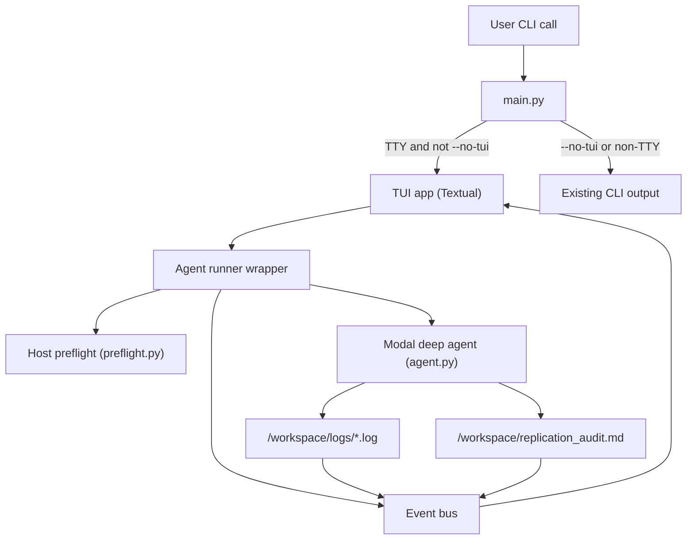

# ReplicateAI TUI — Design Document

Status: Draft v0.2 (econometrics-look conventions, sienna accent locked in)
Author: Sami
Last updated: 2026-05-25
Target deliverable: Full-screen run dashboard TUI (Textual-based) for the existing single-paper replication workflow.

---

## 1. Overview

ReplicateAI today runs as a one-shot CLI: you point it at an example folder, it performs host-side PDF extraction, runs the Modal sandboxed deep agent, and prints a final markdown audit. Logs and intermediate progress are visible only as raw stdout and scattered log files in the Modal `/workspace`.

The TUI adds a full-screen, opinionated terminal experience around that exact workflow:

- Show the selected example pack and LLM provider.
- Walk through phases (Read paper → Specify → Estimate → Audit) with visible status and elapsed time.
- Stream high-signal logs (host preflight summary and `/workspace/logs/*.log`) into a scrollable pane.
- Render the final `replication_audit.md` in a focused markdown pane.

The TUI is a run dashboard, not a chat client. The non-TUI CLI path stays available for CI and scripting.

This document describes the v1 design: a single-screen dashboard for one curated paper, one provider, one run at a time, with a clean, whitespace-heavy aesthetic. Section 10 enumerates what is intentionally out of scope.

## 2. Goals and non-goals

### Goals

- Make one replication run (e.g. Card & Krueger) legible end-to-end in the terminal without reading raw stdout.
- Phase-oriented UX: clear phases with a single active phase highlighted at any time.
- Rich readability: render the final `replication_audit.md` as markdown in a dedicated pane.
- Log visibility: live tail high-signal logs without flooding the screen.
- CLI compatibility: keep the existing non-TUI CLI path intact for CI and scripting (`--no-tui`, non-TTY).
- Minimal new surface area: the TUI is a front-end over `run_agent(...)`; no new backend concepts.
- Aesthetic consistency with ReplicateAI’s product feel: lots of whitespace, single sienna accent color, minimal borders.
- Econometrics legibility: the screen should read like a mini regression table, not a tech dashboard — the published vs. estimated headline coefficient is always front and center.

### Non-goals (v1)

- Interactive chat with the deep agent (no multi-turn user input mid-run).
- Multiple concurrent runs in a single TUI session.
- General-purpose file explorer for `/workspace` or the host project.
- Step-through agent control (no breakpoints, manual tool invocation, or todo editing from the UI).
- Full theming engine; v1 ships with a single light theme.
- Mouse-first design; the TUI is keyboard-first, mouse-optional.

## 3. Background

### Why a TUI

ReplicateAI runs are slow (host PDF extraction, Modal cold-start, multi-step agent loops, sandboxed scripts). Today the user experience is:

- A wall of `pymupdf`/Camelot warnings.
- A long pause while the agent runs.
- A raw Python `dict` (or, after the recent change, a Rich panel) at the very end.

A full-screen TUI replaces that with a single screen that always shows where the run is and what it has produced, which is the difference between a demo that feels like a research toy and one that feels like a product.

### Why Textual

Textual is the right point on the price/power curve for this project:

- Pure Python, integrates trivially with the existing `replicate_ai` package.
- Provides layout, scroll views, keybindings, and markdown rendering out of the box.
- Plays well with Rich, which we already use for the final audit panel.
- Avoids the operational cost of a JS/Zig stack (Ink, OpenTUI) for what is fundamentally a single-screen dashboard.

### Why dashboard, not chat

Per [DESIGN.md §2](./DESIGN.md), v1 is a single hand-picked paper, single dataset, single happy-path narrative. There is no useful mid-run user input: the user picks an example pack and a provider, then watches. A chat surface would imply capabilities (interactive guidance, follow-up questions) that are explicit non-goals for v1.

## 4. Target user and scenarios

The primary user is the developer running the demo (Sami, plus anyone watching a portfolio recording).

Key scenarios:

1. Canonical demo run: launch with no flags, watch the full Card & Krueger replication, end with a clean audit pane.
2. Cheap dry run: switch to `cloudflare-glm` for a fast, cheap harness check; same UI, possibly fewer agent steps.
3. Failure run: agent crashes or times out; user can read the relevant log tail and the failure summary without leaving the TUI.
4. CI / scripting: same binary, `--no-tui`, behaves exactly like today.

## 5. UX

### 5.1 Entry points

- Default (TUI):
  - `uv run replicate-ai ../examples/card_krueger`
  - Conditions: stdout is a TTY and `--no-tui` is not passed and `REPLICATE_AI_NO_TUI` is unset.
- Forced TUI:
  - `uv run replicate-ai --tui ../examples/card_krueger` (useful when wrapping with tools that detach the TTY).
- Non-interactive:
  - `uv run replicate-ai --no-tui ../examples/card_krueger` behaves exactly like today (Rich panel / dict to stdout).
- Environment override:
  - `REPLICATE_AI_NO_TUI=1` globally disables the TUI for a session.

### 5.2 Layout

A single-screen dashboard with three logical regions:

```text
┌──────────────────────────────────────────────────────────────────────────────┐
│  ReplicateAI                                                                 │
│  examples/card_krueger      ·   Anthropic / Sonnet 4.6      ·  00:01:23      │
│                                                                              │
│  ●  Read paper     ○  Specify     ○  Estimate     ○  Audit                    │
└──────────────────────────────────────────────────────────────────────────────┘
┌─────────────── Run log ───────────────┐┌───────────── Detail ─────────────────┐
│                                       ││                                      │
│  [host] Local PDF extract: 26 pages   ││  fte_it = α + β·nj_i × post_t        │
│  [host] Seeded 2 file(s)              ││           + γ·chain_i + δ·co_owned   │
│  [host] Uploaded 2 artifact(s)        ││           + ε_it                     │
│   ●  wrote target_specification.json  ││                                      │
│   ●  wrote results/coefficients.json  ││  β̂ (NJ × Post)   2.85   (1.32)  **   │
│  [sandbox] attempt_01.py: KeyError    ││  published         2.76   (1.36)  *    │
│  …                                    ││  Δ                +0.09   ✓ ok       │
│                                       ││                                      │
│                                       ││  Card & Krueger (1994), AER 84(4),   │
│                                       ││  Table 3, row 4                      │
└───────────────────────────────────────┘└──────────────────────────────────────┘
  Replicating · Card & Krueger (1994) · Minimum Wages and Employment · Table 3
  q quit · r rerun · tab switch pane · g/G top/bottom
```

- Header (top, ~4 rows)
  - Line 1: project name (`ReplicateAI`), in sienna accent.
  - Line 2: example dir · provider · elapsed time, each separated by middle dots.
  - Line 3: blank breathing room.
  - Line 4: phase indicator with journal-styled labels: `Read paper` · `Specify` · `Estimate` · `Audit`. Inactive phases use a dimmed `○`; the active phase is sienna-colored `●` with an inline spinner; completed phases use a muted-green `✓`.

  These display labels are a thin presentation layer over the runner’s internal phases (see §6.1 for the mapping). They are chosen to read like the steps of an empirical paper, not a CI pipeline.

- Main body (split horizontally)
  - Left: Run log pane — scrollable, append-only.
    - Sources, prefixed for legibility:
      - `[host]` for host-side messages (preflight summary, seeds, uploads).
      - `[agent]` for high-level runner status events.
      - `[sandbox]` for tails of `/workspace/logs/*.log`.
    - Truncates after a soft cap (e.g. last 5,000 lines), with a clear marker when older lines were dropped.
  - Right: Detail pane — phase-dependent.
    - During Read paper / Specify: short status text and any early warnings (e.g. “Camelot yielded 0 tables; agent will rely on `paper_text.md`”).
    - During Estimate: model spec equation at the top, headline coefficient card populated as soon as `coefficients.json` is written (per §6.2).
    - During Audit: rendered `replication_audit.md` beneath the headline coefficient card.

- Footer (bottom, 2 rows)
  - Top row — running head (dimmed, journal-style):
    `Replicating · Card & Krueger (1994) · Minimum Wages and Employment · Table 3`
    Sourced from `target_specification.json` once written; until then, falls back to the example dir name.
  - Bottom row — keybinding cheatsheet on the left, transient status messages on the right (e.g. “Modal sandbox terminated”).

### 5.3 Aesthetic

Goal: calm, confident, lots of breathing room. Match the visual feel of the Claude/Anthropic input screen Sami referenced.

- Whitespace and rhythm
  - Generous outer padding (≥ 2 columns / 1 row) around panes.
  - Inner padding inside panes (≥ 1 column / 0–1 row).
  - Avoid stacking dense boxes; let the eye rest.

- Borders
  - Single-line borders only, dimmed.
  - No double-line / heavy box drawing.
  - Panel titles are inline on the top border, lower-cased or sentence-cased.

- Color palette (terminal-respecting; no hard-coded background)

  Single accent: sienna (`#A0522D` / approx. `xterm-256` color `131`). Reads as ink-on-paper, echoes the Anthropic starburst color, and feels closer to a working-paper title block than a tech dashboard.

  Named tokens (resolved in `replicate_ai.tui.theme`):

  - `text` — terminal default foreground.
  - `dim` — 60% gray (borders, inactive phase glyphs, footer keybindings, source prefixes in the run log).
  - `accent` — sienna (project name, active phase glyph, headline coefficient label, deliverable bullets, panel titles).
  - `success` — muted green (`✓`, completed phase glyph, “within tolerance” verdict).
  - `warning` — muted yellow (e.g. “Camelot found no tables”, “borderline tolerance”).
  - `error` — muted red (failed phase, traceback markers, “outside tolerance” verdict).

  Rules:

  - Never set a background color; respect the user’s terminal.
  - Use `accent` sparingly — at most one accent-colored element per visual region.
  - All colors must remain legible in both light and dark terminals.

- Typography
  - Monospace by necessity, but lean on:
    - Headings via accent color + uppercase or sentence case.
    - Indentation and grouping rather than ASCII art separators.
  - Avoid emoji in the UI chrome; use simple glyphs (`●`, `○`, `·`, `✓`, `✗`).

- Motion
  - Subtle: a single spinner glyph next to the active phase while it runs.
  - No flashing colors, no rapid redraws.

### 5.4 Interaction model

Keyboard-centric, mouse-optional.

- Global
  - `q` — quit (confirm if a run is in progress).
  - `r` — rerun the same configuration.
  - `tab` / `shift+tab` — cycle focus between log pane and detail pane.
  - `?` — toggle help overlay (optional v1).

- Log pane (focused)
  - `↑` / `↓`, `PgUp` / `PgDn` — scroll.
  - `g` / `G` — jump to top / bottom.
  - `f` — toggle follow mode (auto-scroll to bottom on new lines).

- Detail pane (focused)
  - Same scroll controls.
  - In v1, no inline links or selectable elements.

No text-entry prompt is required for v1. A future `/command` prompt is left as a stub in §10.

### 5.5 Econometrics conventions

The TUI’s job is to make a single replication run read like a journal page. The following conventions apply across all panes; they are deliberately conservative and mirror the visual conventions of an applied economics paper.

#### Numbers

- All coefficients render with 2 or 3 decimals, matching the precision printed in the paper. The runner picks the precision once (from `target_specification.json`) and uses it everywhere on screen.
- Standard errors appear in parentheses on the same line as the point estimate, e.g. `2.85 (1.32)`. Never on a separate line in v1.
- Right-align all numeric columns on the decimal point.
- Significance stars follow the standard convention: `*` p<0.01, `` p<0.05, `*` p<0.10. Stars sit one column to the right of the SE and are dimmed; the magnitude reads first.
- p-values, when shown, render in `[ ]` brackets, e.g. `[0.031]`, never decorated with stars in the same cell as the SE.

#### Greek letters and model spec

- Once `target_specification.json` is written, the detail pane renders the headline equation in Unicode on a single line, e.g.:

  ```text
  fte_it = α + β · nj_i × post_t + γ · chain_i + δ · co_owned_i + ε_it
  ```

  Parameter Greek letters (α, β, γ, δ, ε) are taken from a small fixed alphabet; if the spec lists more controls than letters, the runner truncates with `+ Σ_k γ_k · X_k_i` and lists the controls below in dimmed text.
- The headline parameter in the equation (typically β) is rendered in `accent` (sienna); all other Greek letters are `text`.

#### Headline coefficient card

The detail pane always reserves space, near the top, for the headline coefficient block. Empty until `coefficients.json` is available; populated thereafter (see §6.2 for the exact layout).

#### Deliverable bullets

The agent’s contract has three deliverable artifacts (per [DESIGN.md §6](./DESIGN.md)): `target_specification.json`, `results/coefficients.json`, and `replication_audit.md`. The TUI promotes these to first-class events:

- In the run log, each deliverable write renders as a sienna `●` bullet on its own line:
  ```text
   ●  wrote target_specification.json
   ●  wrote results/coefficients.json
   ●  wrote replication_audit.md
  ```
- All other agent / sandbox lines are dimmed by default. This keeps the eye on the journal-paper signal: contract → estimate → verdict.

#### Verdict glyphs

- `✓` (success) — within tolerance per the auditor.
- `△` (warning) — borderline (e.g. point estimate within tolerance but significance bucket differs).
- `✗` (error) — outside tolerance, or audit absent.

Used in the headline coefficient card and the phase row only. Avoid scattering them through the run log.

#### Typography

- Section labels inside panes (e.g. `Coefficient`, `Verdict`, `Notes`) render in uppercase, dimmed, with no underline — closer to a working-paper section header than a UI label.
- Numbers always use the terminal’s monospace font; no attempt at proportional rendering.
- Avoid emoji in chrome; the only glyphs in the TUI are `●`, `○`, `·`, `✓`, `△`, `✗`, and the Greek letters in the model spec.

## 6. Functional behavior

### 6.1 Lifecycle and phases

The runner emits 5 internal phases; the header shows 4 journal-styled labels. The display label is computed from the runner phase plus the presence of the agent’s deliverable files in `/workspace`.

| Display label | Active when                                                                                                          |
|---------------|----------------------------------------------------------------------------------------------------------------------|
| Read paper    | runner phase ∈ {`preflight`, `seeding`}                                                                              |
| Specify       | runner phase = `agent` and `target_specification.json` does not yet exist                                        |
| Estimate      | runner phase = `agent` and `target_specification.json` exists (regardless of whether `coefficients.json` exists yet) |
| Audit         | runner phase ∈ {`audit`, `done`}                                                                                     |

Lifecycle:

1. Initialization
   - Resolve `example_dir` and provider from CLI args / env.
   - Render the header and an empty body. The detail pane shows a one-paragraph summary of the configuration and phases that are about to run.
   - Auto-start the run; do not require an explicit “Press Enter” for v1.

2. Read paper — runner phase `preflight` then `seeding`
   - Call host-side preflight (`replicate_ai/preflight.py:run_local_pdf_extract`).
   - Emit:
     - `[host]` resolved PDF path (`card_krueger.pdf` or `paper.pdf`).
     - `[host]` extraction summary line (pages, tables, char counts).
   - Then call `seed_example_to_sandbox`, `upload_extract_artifacts`; emit `[host]` events for seeded and uploaded counts.
   - On failure: log full traceback in the run log, set the failed phase glyph to `✗`, and surface a one-line cause in the detail pane.

3. Specify — runner phase `agent`, no `target_specification.json` yet
   - Invoke the deep agent.
   - The detail pane shows: “Reading paper, drafting target specification…”
   - When `target_specification.json` appears, render the model equation in the detail pane (per §5.5) and advance the display label to Estimate. Emit a sienna `●` deliverable bullet.

4. Estimate — runner phase `agent`, `target_specification.json` exists
   - In parallel, periodically poll Modal `/workspace/logs/` and tail the most recent log file(s); emit `[sandbox]` events.
   - When `results/coefficients.json` appears, populate the headline coefficient card in the detail pane (per §6.2) and emit a sienna `●` deliverable bullet.
   - Update phase + elapsed time while the agent is active.

5. Audit — runner phase `audit` then `done`
   - When `/workspace/replication_audit.md` becomes available and readable:
     - Emit a sienna `●` deliverable bullet.
     - Render the audit markdown beneath the headline coefficient card.
   - Show a single-line Run complete summary (success/failure, headline coefficient vs. published, verdict glyph).

6. Post-run
   - Leave the screen with logs and audit visible.
   - Allow user to:
     - Quit.
     - Rerun with the same configuration.

### 6.2 Run summary and headline coefficient card

The detail pane is anchored, top-down, by three blocks:

1. Model spec (one line, Greek letters; populated when `target_specification.json` exists).
2. Headline coefficient card (populated when `coefficients.json` exists).
3. Audit body (the rendered `replication_audit.md`; populated when the auditor finishes).

The headline coefficient card mirrors a regression-table row and reads as the single most important thing on the screen.

```text
COEFFICIENT  ─────────────────────────────────────────────────────────

  β̂ (NJ × Post)        2.85   (1.32)  **
  published             2.76   (1.36)  *
  Δ                    +0.09   ✓ within tolerance

  CI 95%        0        2        4        6
                |--------|--------|--------|
                [────────●────◆────────────]
                         est.  pub.
```

Conventions:

- Section label (`COEFFICIENT`) is uppercased and `dim`, mirroring §5.5.
- The headline parameter label (e.g. `β̂ (NJ × Post)`) is in `accent` (sienna); all numbers use `text`.
- Significance stars (`*`, ``, `*`) follow §5.5 and are dimmed.
- The Δ row is the difference between estimate and published value, signed, with the verdict glyph (`✓`, `△`, or `✗`) and short tolerance phrase.
- The CI strip is a single-line ASCII visualization. The estimate marker is `●` (sienna), the published value marker is `◆` (`text`), and the strip ends are `[ ]`. The axis range is rounded outward to whole numbers that span both points and their SEs.
- If `coefficients.json` is absent, the entire card is hidden — never show empty placeholders.

After the audit completes, the runner prepends a single-line Run complete banner above the model spec, in `text`, e.g.:

```text
Run complete · 00:03:12 · ✓ within tolerance
```

Numbers come from `coefficients.json` and `target_specification.json` in `/workspace`, parsed by the runner. If parsing fails, fall back to “Run complete · audit available below.”

Decimal precision and SE/p-value formatting follow §5.5.

### 6.3 Error handling

- Modal sandbox errors (timeout, auth, image build):
  - Concise summary in the detail pane.
  - Full error text in the log pane.
- LLM/API errors:
  - Surface HTTP codes and high-level cause (e.g. Cloudflare timeout vs. auth).
- Missing audit:
  - If the agent run returns but `/workspace/replication_audit.md` is missing or unreadable:
    - Detail pane shows: “Agent run finished without writing `/workspace/replication_audit.md`. Check logs for traceback.”
    - Phase glyph is `✗`.

## 7. Architecture

### 7.1 High-level flow

The TUI wraps the existing runner; it does not replace it.



### 7.2 Runner abstraction

Introduce a thin runner layer that both `main.py` (CLI) and the TUI consume.

Responsibilities:

- Orchestrate preflight, sandbox creation, seeding, agent invocation, and cleanup.
- Emit structured events instead of (or in addition to) raw `print()` calls.

Event types (final names TBD during implementation):

- `PhaseChanged(phase: Literal["preflight","seeding","agent","audit","done"])` — runner-internal phases.
- `Status(message: str, source: Literal["host","agent","sandbox"])`
- `LogChunk(source: Literal["host","sandbox"], text: str)`
- `DeliverableWritten(name: Literal["target_specification.json","coefficients.json","replication_audit.md"])` — emitted when the runner observes one of the agent’s contract files appear in `/workspace`. Drives the display-label transitions in §6.1, the headline coefficient card in §6.2, and the sienna deliverable bullets in the run log (§5.5).
- `CoefficientsParsed(estimates: dict, published: dict, verdict: Literal["ok","borderline","fail"])` — emitted when `coefficients.json` is parsed against `target_specification.json`. Carries the data needed to render the §6.2 headline card without re-reading files in the UI thread.
- `AuditReady(markdown: str)`
- `RunFinished(success: bool, result: dict | None, error: str | None)`

The non-TUI CLI subscribes to a minimal subset (typically just the final result + any errors); the TUI subscribes to everything. The runner — not the TUI — owns the internal-phase → display-label mapping in §6.1, so a future non-Textual front-end can reuse the same logic.

### 7.3 TUI implementation details

- Framework: [Textual](https://textual.textualize.io/).
- Widgets (target composition):
  - `Header` (custom, three-line layout for title / context / phases).
  - `Horizontal` split:
    - `RichLog` for the run log.
    - `Markdown` (or `RichLog` with rendered content) for the detail pane.
  - `Footer` for keybindings.
- Concurrency:
  - Run the synchronous runner in a background thread (`asyncio.to_thread`) or as a Textual `Worker`.
  - Push events into the UI via Textual messages (`post_message`).
- Theme:
  - Single theme module (`replicate_ai.tui.theme`) exposing `text`, `dim`, `accent` (sienna), `success`, `warning`, `error` tokens per §5.3.
  - A small formatter module (`replicate_ai.tui.format`) owns the econometrics conventions in §5.5: number rendering, significance stars, model-spec equation rendering, headline-coefficient card layout, and CI strip drawing. Both the TUI and any future non-TUI report can reuse it.

### 7.4 Modal log polling

- While the agent phase is active:
  - Every N seconds (configurable, e.g. 1.5s):
    - List `/workspace/logs/` via `modal_sandbox.filesystem`.
    - Pick the most recent log file (or all changed since last poll).
    - Read from the last known offset and emit `LogChunk` events for new bytes.
- Stop polling when:
  - The runner signals `RunFinished`, or
  - A hard timeout is reached (aligned with `SANDBOX_TIMEOUT_SECONDS`).

### 7.5 Threading and cancellation

- Quitting the TUI while a run is active should:
  - Cancel the polling loop.
  - Terminate the Modal sandbox via the existing `finally` cleanup in `run_agent`.
  - Avoid leaking threads.

## 8. Configuration

- CLI flags
  - `--tui` — force TUI even if stdout is not a TTY.
  - `--no-tui` — force non-TUI behavior even on a TTY.
- Environment
  - `REPLICATE_AI_NO_TUI=1` — globally disable TUI.
  - All existing env vars (`LLM_PROVIDER`, Cloudflare/Anthropic/Modal credentials, `LANGSMITH_*`) continue to work unchanged.
- Future TUI config (out of scope for v1)
  - `tui.toml` with default provider, log polling interval, theme selection.

## 9. Risks and mitigations

- TUI must remain responsive while the agent runs.
  - Mitigation: offload all blocking work to a worker thread; the UI thread only handles events and redraws.
- Log volume can flood the UI.
  - Mitigation: cap retained lines; mark truncation visibly; allow the user to follow vs. scroll independently.
- Terminal compatibility.
  - Mitigation: stick to Textual defaults; avoid custom escape sequences; verify on iTerm2, macOS Terminal, and tmux.
- Aesthetic regressions in dark vs. light terminals.
  - Mitigation: never set background; use semantic + accent tokens that work against both.
- Demo recording artifacts.
  - Mitigation: avoid spinners and color updates that cause excessive frame churn; provide a “quiet mode” for recordings if needed.

## 10. Out of scope (v1) / future work

- Interactive command prompt (`/rerun`, `/open log`, `/open script`).
- Step-wise agent debugging (visualizing tool calls, todos, sub-agent handoffs).
- Multi-run history sidebar.
- Multi-paper picker for browsing and launching example packs.
- Theme picker and persistent UI preferences.
- Mouse-first interactions (drag-resize panes, click on log lines to open files).

---
